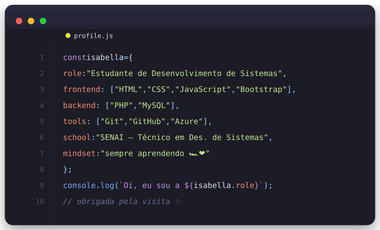

 

  

Mostrar Imagem

 

Mostrar Imagem Mostrar Imagem

  
 Sobre mim
 Estudante do Técnico em Desenvolvimento de Sistemas no SENAI
 Aprendendo front-end e back-end na prática, em aulas e projetos próprios
 Sempre buscando aprender algo novo
 Curto tecnologia e novos desafios
 
 Stack
<table align="center" border="0" cellspacing="0" cellpadding="12"> <tr> <td align="center" width="33%">

Front-end

 

Mostrar Imagem Mostrar Imagem Mostrar Imagem Mostrar Imagem

</td> <td align="center" width="33%">

Back-end

 

Mostrar Imagem Mostrar Imagem

</td> <td align="center" width="33%">

Ferramentas

 

Mostrar Imagem Mostrar Imagem Mostrar Imagem

</td> </tr> </table>  
 Estatísticas

      
   

Obrigada pela visita — bora trocar uma ideia sobre código? ✨

